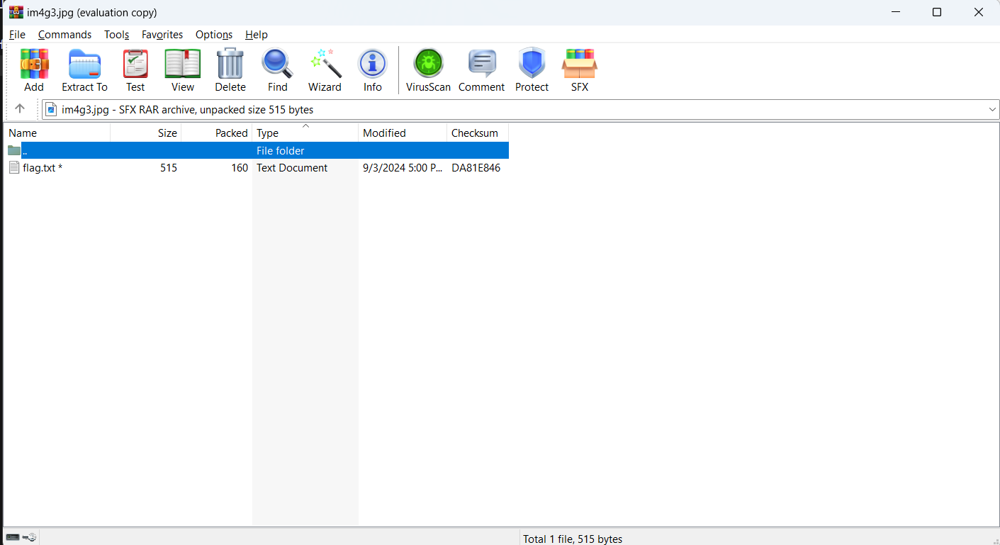
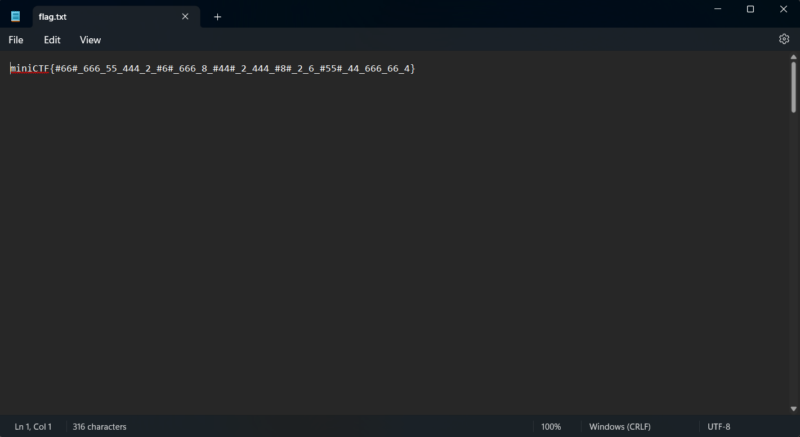
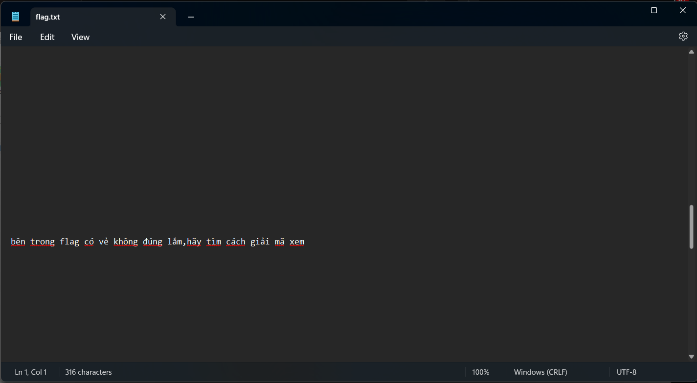
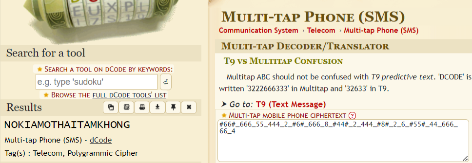

Đề bài cho ta 1 file ảnh đáng ngờ

https://drive.google.com/file/d/1mn-Dw-2KNOvhI3THqJcLMDgD7HIQb6Qx/view?usp=sharing

mở bằng winrar ta thấy có 1 file flag.txt cần mật khẩu

thử các mật khẩu thông dụng ,trong đó có 123456 thì ta mở dc file flag.txt.Nội dung của file flag.txt như sau

lần mò trên https://www.dcode.fr thì ta tìm được flag

`miniCTF{NokiaMotHaiTamKhong}`

mình ra đề chưa được rõ format của flag lắm,mình sẽ rút kinh nghiệm cho những lần tới
